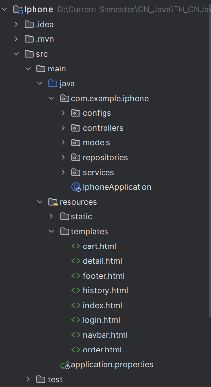
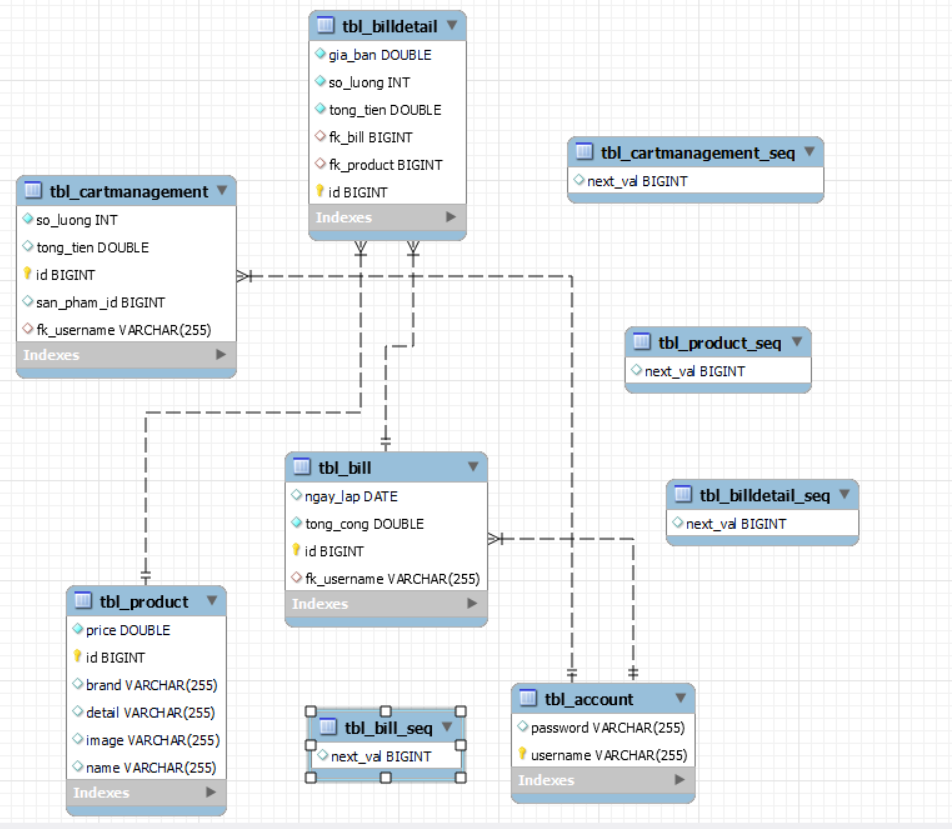

# Iphone Store

## Giới thiệu
Iphone store là web thương mại điện tử, sử dụng Java Spring Boot. Dữ liệu được lưu trữ bằng MySQL. Dự án bao gồm các tính năng sau:

- Hiển thị sản phẩm: Các sản phẩm được hiển thị.
- Lọc sản phẩm: Người dùng có thể lọc sản phẩm theo nhiều tiêu chí như danh mục, giá cả.
- Tìm kiếm sản phẩm: Tính năng tìm kiếm cho phép người dùng tìm sản phẩm theo từ khóa.
- Quản Lý Giỏ Hàng: Người dùng có thể thêm và xoá sản phẩm trong giỏ hàng của họ.
- Lịch sử mua hàng: Người dùng có thể xem lịch sử mua hàng của mình.
- Thanh Toán và Xem Hóa Đơn: Tính năng thanh toán cho phép người dùng hoàn tất mua hàng và xem hóa đơn của các đơn hàng đã thanh toán.

## Cấu trúc thư mục

## ERD

## Setup

### Chạy dự án
1. Clone project
2. Tạo database "iphone_db" trong MySQL
3. Cấu hình kết nối dự liệu trong file application.yml (cấu hình dựa theo tên database)
4. Mở dự án in IntelliJ IDEA
5. Đến lớp IphoneApplication để chạy
6. Ứng dụng chạy, mở trình duyệt với đường dẫn tương ứng với file application.yml

